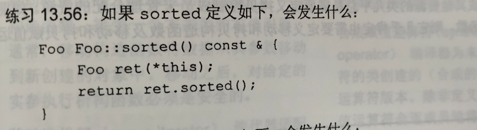

# C++ 作业 （11月）

## 第一题


``` C++
#include <vector>
vector<int>  src;// 创建名叫src的int类型的容器

vector<int> src(dst);// 创建一个int类型的src容器，里面的内容与dst容器相同

vector<int> src={1,2,3,4,5,6,7} ;// 创建了一个int类型src容器，里面的值为1,2,3,4,5,6,7

vector <int> src (dst.begin()+2 , dst.end()-2 );//创建的src容器内容是dst的第三个到倒数第二个

vector <int> src(5);//创建src容器包含5个元素，并且对每个元素初始化为0

vector<int> src(7,3)//创建int类型的src容器，有七个元素并且七个元素初始化为3
```
## 第二题

```c++
#include <deque>
#include<vector>
int main()
{
    vector<int> list={1,2,3,4,5,6,7,8,9,10};
    deque<int> list1,list2;
    for(int i=0;i<list.size();i++)
    {
            if(list[i]%2==0)
            [
                list1.push_buck(list[i]);
            ]
            else{
                 list2.push_back(list[i]);
            }
    }
}
```
## 第三题

答：减少为包含十个元素的容器。

## 第四题

```c++
#include<iostream>
#include<vector>
#include<string>
using namespace std;
void change(string s,string oldVal,string newVal)
{
        int i=0;
        string b=s;
        string::iterator iter,iter_;
        string::iterator iter1=s.begin();
        string::iterator iter2=s.end()-newVal.length();
        for(iter=iter1;iter!=iter2;iter++)
        {
                if(s.substr(i,i+oldVal.length())==oldVal)
                {
                        s.erase(s.begin()+i,s.begin()+i+oldVal.length());
                        s.insert(s.begin()+i,newVal.begin(),newVal.end());
                }
                i++;
        }
        cout << s;

}
int main()
{
        string s,oldVal,newVal;
        cin >> s >> oldVal >> newVal;
        change(s,oldVal,newVal);
        return 0;
}
```
## 第五题
 

## 第六题
 
```c++
#include<iostream>
#include<string>
#include<vector>
#include<numeric>
using namespace std;
int main()
{
    vector<int>a;
    for(int i=0;i<100;i++)
    {
        a.push_back(i);
    }
    int sum=accumulate(a.begin(),a.end(),0);
    cout << sum << endl;
}
```
## 第七题
 
```c++
#include<iostream>
#include<string>
#include<vector>
#include<numeric>
using namespace std;
int main()
{
    int a=2,b=3;
    auto sum=[a](int b)->int{return a+b;};
    int result=sum(b);
    cout << result;
}
```
## 第八题
 
```c++
#include<iostream>
#include<string>
#include<vector>
#include<numeric>
using namespace std;

int main()
{
   vector<int>list={1,2,3,4,5,6,7,8,9,10};
   vector<int> ::reverse_iterator  iter;
   for(iter=list.rbegin();iter!=list.rend();iter++)
   {
       cout << *iter<< endl;
   }
```
## 第九题
 
```c++
#include<numeric>
#include<list>
#include<algorithm>
using namespace std;
int main()
{
   list<string> words={"fox","fox","jumps","over","quick","red","slow","the","turtle","quick","over","red"};
     words.sort();
    words.unique();
    list<string>::iterator it;
    for(it=words.begin(); it!=words.end();it++)
    {
        cout << *it <<endl;
    }
```
## 第十题
 
```c++
#include<iostream>
#include<string>
#include<vector>
#include<numeric>
#include<list>
#include<algorithm>
using namespace std;
int main()
{
    typedef pair<int ,string> istring;
    vector<istring> k(10);
    for (int i=0;i<3;i++)
    {
        cin >> k[i].first ;
        cin >> k[i].second;
    }
    for(int i=0;i<3;i++)
    {
        cout << i << ":  " << "first : " << k[i].first << "  second : "<<k[i].second << endl;
    }
}
```
## 第十一题
 
```c++
1.在c的后面加入v
2.在c的后面加入v
3.在每一个v的元素后面依次加入对应c的元素
4.在v的后面加入c的元素
```
## 第十二题
 

## 第十三题
 
调用了3次

## 第十四题
 
```c++
#include<iostream>
#include<string>
#include<vector>
#include<numeric>
#include<list>
#include<algorithm>
#include<set>
using namespace std;
static int n=10;
 class Employee
{
    public:
        Employee();
        Employee(string nam);
        
    private:
        string name;
        int id;
};
Employee::Employee()
{
    id=n++;
    name="no name";
    cout << name<<endl;
    cout << id << endl;
};
Employee::Employee(string nam)
{
    name=nam;
    id=n;
    n++;
    cout << name << endl;
    cout << id << endl;
};
int main()
{
   Employee employee("aa");
   Employee em;
   
}
```
## 第十五题
 
```c++
int&& r1 = f();           // f()返回右值，因此需以右值引用来绑定
int& r2 = vi[0];          // 变量表达式，以左值引用绑定
int& r3 = r1;             // 绑定了右值引用的变量，以左值引用绑定
int&& r4 = vi[0] * f();    // 返回右值的表达式，以右值引用绑定
```
## 第十六题
 

## 第十七题
 
因为通过拷贝构造函数生成的ret是一个左值，因此会继续调用当前版本的sorted函数，直至内存泄露。

## 第十八题
 
```c++
(a)string
(b)string
(c)vector
(d)string
```
## 第十九题
 
```c++

#include <iostream>
using namespace std;
class Sales_data 
{
public:
    Sales_data(){}
    Sales_data operator +(Sales_data &a); 
    Sales_data(int a,int b);
    Sales_data &operator+=(const Sales_data &a);
    void display();
    int age;
    int height;
};

Sales_data& Sales_data::operator+=(const Sales_data &a)
{
	age += a.age;
	height += a.height;
	return *this;
}
Sales_data Sales_data::operator +(Sales_data &a)
{
    Sales_data c;
    c.age=age+a.age;
    c.height=height+a.height;
    return c;
}
Sales_data::Sales_data(int a,int b)
{
    this->age=a;
    this->height=b;
}
void Sales_data::display()
{
    cout << age << endl;
    cout << height << endl;
}
int main()
{
    Sales_data a(12,12);
    Sales_data b(24,24);
    Sales_data c;
    c=a+b;
    a+=b;
    c.display();
    a.display();
}
```
## 第二十题
 
```c++

```
## 第二十一题
 
ld = si + ld是非法的。首先两者类型无法互相转换，因此无法通过重载的+运算符来实现。其次，SmallInt可以转换为int，而LongDouble可以转换为float和double。而int可以与float以及double执行内置加法运算，因此将导致二义性。

ld = ld + si是可行的。因为si在ld的右侧，这就导致了LongDouble的成员函数可以执行。另外，其非成员函数也可以执行，但需要经过一重转换（SmallInt->double），因此会执行其成员函数。

## 第二十二题
 
有必要，两个功能不影响。

## 第二十三题
 
```c++
class Max_quote:public Disc_quote
{
public:
	Max_quote(const string& book, double p, size_t qty, double disc):
	Disc_quote(book,p,qty,disc){}

	double net_price(size_t n) const override {
		if(n >= quantity)
			return quantity*(1-discount)*price + (n-quantity)*price;
		else
			return n*(1-discount)*price;
	}

};
```
## 第二十四题
 
```c++
#ifndef MYBASKET_H
#define MYBASKET_H
#include "Bulk_quote.h"
#include <set>


class basket
{
public:
	void add_item(Quote&& sale) {
		items.insert(shared_ptr<Quote>(move(sale).clone()));
	}
	void add_item(const Quote& sale) {
		items.insert(shared_ptr<Quote>(sale.clone()));
	}

	double total_receipt(ostream& os) const {
		double sum = 0;
		for(auto iter = items.begin(); iter != items.end(); iter = items.upper_bound(*iter)) {
			sum += print_total(os,**iter,items.count(*iter));
		}
		os << "Total Sale: " << sum <<endl;
		return sum;
	}
private:
	bool static compare(const shared_ptr<Quote>& a, const shared_ptr<Quote>& b) {
		return a->isbn() < b->isbn();
	}
	multiset<shared_ptr<Quote>,decltype(compare)*> items{compare};
	
};
#endif
```